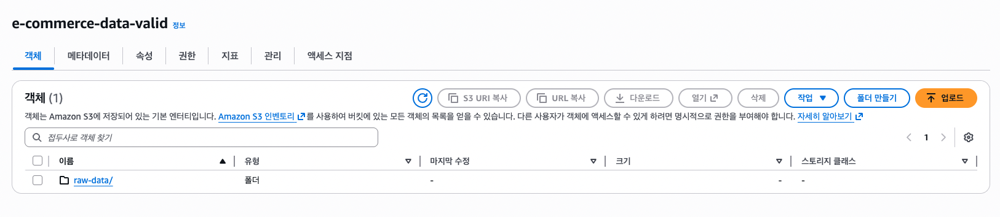
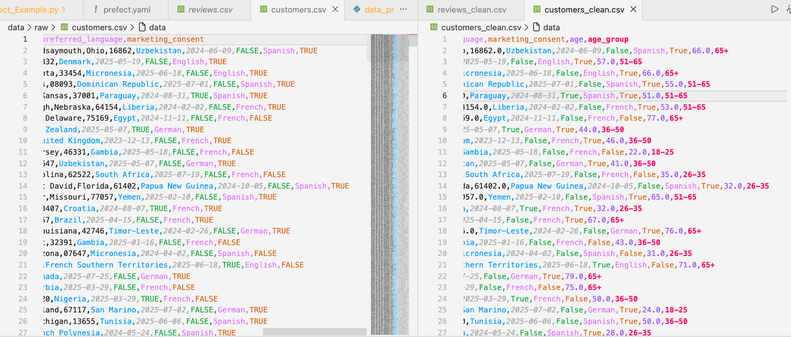
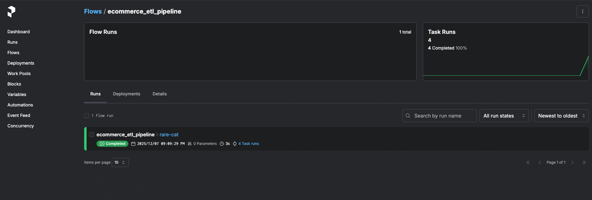

# E-commerce 데이터 엔지니어링 파이프라인 

클라우드 서비스를 활용하여 **실제 운영 환경 수준의 데이터 파이프라인**을 구축

---

## 과정 개요

- **데이터 파이프라인**: 가상의 전자상거래 데이터 기반 ETL 프로세스  
- **클라우드 통합**: AWS S3 데이터 레이크 활용  
- **워크플로우 오케스트레이션**: Prefect를 활용한 오케스트레이션  
- **컨테이너화**: Docker를 이용한 운영 환경 배포  
- **데이터 처리**: 고급 데이터 변환 및 비즈니스 지표 생성  

---

## 기술 스택

| 구분 | 기술 | 용도 |
|------|------|------|
| 언어 | Python 3.12 | 핵심 개발 언어 |
| 클라우드 | AWS S3 | 확장 가능한 데이터 레이크 저장소 |
| 오케스트레이션 | Prefect 3.x | 워크플로우 관리 및 모니터링 |
| 데이터 처리 | Pandas | 데이터 변환 및 분석 |
| 컨테이너화 | Docker + Docker Compose | 운영 환경 배포 |
| 패키지 관리 | pip, requirements.txt | 의존성 관리 |

---

## 프로젝트 구조

```
Hands-On-Project/
├──  .env                              # AWS 인증 정보 
├──  data-pipeline/                    # 메인 파이프라인 코드
│   ├──  requirements.txt              # Python 의존성
│   ├──  docker-compose.yml            # 컨테이너 오케스트레이션
│   ├──  src/                          # 소스 코드
│   │   ├── data_ingestion/            # S3 업로드 스크립트
│   │   │   └── s3_uploader.py     # AWS S3로 데이터 업로드
│   │   ├── data_processing/           # ETL 변환 작업
│   │   │   └── etl_processor.py   # 데이터 정제 및 변환
│   │   └── orchestration/             # 워크플로우 관리
│   │       └── prefect_flows.py   # Prefect 오케스트레이션
│   ├──  infrastructure/               # 컨테이너 인프라
│   │   └── docker/
│   │       └── Dockerfile             # 컨테이너 빌드 지침
└── └──  tests/                        # 테스트 파일
        └── test_aws_connection.py     # AWS 연결 테스트

```
# Data Pipeline 

## Step 1: 환경 설정

**의존성 패키지 설치:**
```bash
cd data-pipeline
pip install -r requirements.txt
```

**AWS 자격증명 설정:** 프로젝트 루트에 `.env` 파일 생성:
```env
AWS_ACCESS_KEY_ID=your_access_key_here
AWS_SECRET_ACCESS_KEY=your_secret_key_here
AWS_DEFAULT_REGION=ap-northeast-2
AWS_S3_BUCKET_NAME=your-unique-bucket-name
```

---

## Step 2: 설정 확인

**AWS 연결 테스트:**
```bash
python tests/test_aws_connection.py
```

**샘플 데이터 확인:**
```bash
# data/raw/ 폴더에 데이터가 있는지 확인
ls ../data/raw/
```

---

## Step 3: 데이터 파이프라인 실행

**1. 원본 데이터를 S3에 업로드**
```bash
python src/data_ingestion/s3_uploader.py
```



**2. 데이터 처리 및 변환**
```bash
python src/data_processing/etl_processor.py
```


**정제 전후 데이터 비교:**

오른쪽 정제 후의 경우 `age`, `age_group` 필드가 추가된 것을 확인할 수 있다.



**3. 오케스트레이션 파이프라인 실행**
```bash
python src/orchestration/prefect_flows.py
```

---

## Step 4: Prefect 오케스트레이션

**1. Prefect 서버 시작**
```bash
prefect server start
```

**2. Prefect UI 접속**

브라우저에서 http://localhost:4200 열기

**3. 파이프라인 실행 모니터링**
- 플로우 실행 내역, 태스크, 로그 확인
- 성능 지표 및 에러 모니터링



2분 단위로 실행되는 것을 확인할 수 있다.


---

## Step 5: 컨테이너화

**1. 컨테이너 빌드 및 실행**
```bash
docker-compose -f data-pipeline/docker-compose.yml up --build -d
```

**2. 컨테이너화된 파이프라인 실행**
```bash
docker exec -it data-pipeline-data-pipeline-1 python data-pipeline/src/orchestration/prefect_flows.py
```

**3. 컨테이너화된 Prefect UI 접속**

브라우저에서 http://localhost:4200 열기

**도커로 실행:**


**파이프라인 재실행 결과:**

기존 버킷을 삭제하고 도커로 파이프라인을 재실행하면 현재 시간으로 새로운 버킷이 생성된다.


## Sample Data Overview

pipeline processes realistic e-commerce data:

| Dataset | Records | Description |
|---------|---------|-------------|
| **customers.csv** | 1,000+ | Customer profiles, demographics |
| **products.csv** | 500+ | Product catalog, categories, pricing |
| **orders.csv** | 2,000+ | Order transactions, timestamps |
| **order_items.csv** | 6,000+ | Individual items per order |
| **reviews.csv** | 1,500+ | Customer reviews and ratings |


